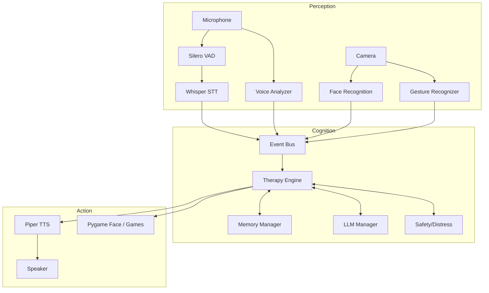

# BMO Autism Therapy Robot - Complete Technical Analysis

## SECTION 1: EXECUTIVE OVERVIEW

**Project Identity**: BMO is a specialized, interactive, physical therapy companion robot designed to assist children with autism spectrum disorder (ASD). It operates locally on edge hardware (Raspberry Pi 5) to ensure low latency and maximum privacy.

**Main Purpose**: To provide accessible, gamified, and responsive autism therapy, focusing on emotional recognition, social skills training, memory improvement, and sensory regulation through natural voice and visual interactions.

**Target Users**: 
1. **Primary**: Children with ASD (ages 3-10).
2. **Secondary**: Parents, caretakers, and occupational therapists who use the dashboard to monitor progress.

**Core Functionality**:
- Real-time offline speech-to-text (Whisper) and text-to-speech (Piper).
- Emotional and engagement tracking via face recognition (InsightFace) and voice analysis.
- LLM-driven therapeutic conversation pipeline with embedded safety and distress filters.
- A suite of Pygame-based therapeutic games.
- Real-time video/face rendering on a hardware display.

**Major Features**:
- **Event-Driven Architecture**: A central event bus routes sensor data asynchronously.
- **Therapeutic Engine**: Adapts to the child's frustration, engagement, and emotional state.
- **Game Orchestrator**: Manages state transitions between idle conversation and active gameplay.
- **Local RAG Memory**: Uses ChromaDB to recall past interactions and user profiles.

**Business Value**: Dramatically lowers the cost of continuous ASD therapy by providing an always-available, infinitely patient, culturally adaptable AI companion.

---

## SECTION 2: PROJECT ARCHITECTURE

**Complete Architecture Overview**:
The system is built on an asynchronous, event-driven microservices pattern running within a single Python process. The architecture is split into three main layers:
1. **Perception Layer (Sensors)**: Audio capture (SoundDevice), VAD (Silero), STT (Faster-Whisper), Camera (Picamera2), Face Detection (InsightFace), Voice Analyzer.
2. **Cognitive Layer (Brain)**: Therapy Engine, Memory Manager (ChromaDB + SQLite), Emotion Fusion, Adaptive Difficulty, Safety Monitors, LLM Provider Manager (Groq/Gemini).
3. **Action Layer (Actuators)**: TTS (Piper), Audio Playback, Pygame Face Display, Game Dashboard.

**Mermaid Component Interaction Diagram**:


**Service Communication Flow**:
Components do not call each other directly. Instead, they publish and subscribe to the `event_bus.py`. For example, STT publishes `speech.transcribed`, which the `TherapyEngine` subscribes to.

**Data Flow**: Audio chunk -> VAD -> STT -> Text -> LLM -> Text -> TTS -> Audio chunk -> Speaker.

**Why the Architecture was Chosen**:
- *Advantages*: Extreme decoupling. If a new sensor is added (e.g., heart rate), it just publishes to the bus without rewriting the engine. 
- *Limitations*: Event debugging is complex; stack traces lose origin context.
- *Scalability*: Can easily distribute components across multiple threads or even external microservices via MQTT if needed.

---

## SECTION 3: FOLDER STRUCTURE ANALYSIS

```text
project/
├── robot/
│   ├── analytics/    (Progress and session reporting logic)
│   ├── audio/        (Mic and speaker hardware interfacing)
│   ├── config/       (Env vars and settings dataclasses)
│   ├── dashboard/    (Flask web interface for parents)
│   ├── database/     (SQLite schemas and migrations)
│   ├── difficulty/   (Adaptive difficulty scaling for games)
│   ├── emotion/      (Face/Voice feature extraction)
│   ├── engagement/   (Camera, face tracking, gestures)
│   ├── games/        (Therapeutic minigames logic)
│   ├── gui/          (Pygame face animation and game UI)
│   ├── llm/          (Groq and Gemini API integrations)
│   ├── memory/       (Short-term context, long-term ChromaDB)
│   ├── profiles/     (Child user profiles)
│   ├── rewards/      (Gamification, badges, scoring)
│   ├── safety/       (Content filtering and distress detection)
│   ├── services/     (Event Bus, Service Registry)
│   ├── stt/          (Faster Whisper offline speech recognition)
│   ├── therapy/      (Core logic, rules, orchestration, state)
│   ├── tts/          (Piper TTS offline voice synthesis)
│   └── vad/          (Silero Voice Activity Detection)
├── data/             (SQLite db, ChromaDB store, logs)
├── models/           (ONNX models for VAD, TTS, etc.)
└── tests/            (Unit tests)
```

---

## SECTION 4: FILE-BY-FILE ANALYSIS

### `main.py`
**Purpose**: The central bootstrapper. Initializes hardware, loads models, starts async loops, and binds services to the event bus.
**Responsibilities**: Hardware init, task orchestration, graceful shutdown.
**Functions**: `bootstrap()`, `run()`, `_vad_loop()`, `start_flask()`, `shutdown()`.
**Dependencies**: Every module in `robot/`.

### `robot/services/event_bus.py`
**Purpose**: Core pub/sub messaging system.
**Responsibilities**: Route events asynchronously, decouple systems.
**Classes**: `EventBus` (singleton).
**Methods**: `subscribe()`, `publish()`.

### `robot/services/service_registry.py`
**Purpose**: Dependency injection container.
**Classes**: `ServiceRegistry` (stores active singletons to prevent circular imports).

### `robot/audio/capture.py` & `playback.py`
**Purpose**: Hardware audio interfacing.
**Responsibilities**: Async streaming of audio chunks.
**Classes**: `AudioCapture`, `AudioPlayback`.
**Methods**: `get_chunk_async()`, `enqueue_chunk()`.
**Improvement**: Recently migrated from librosa to scipy to avoid Numba conflicts on RPi5.

### `robot/config/settings.py`
**Purpose**: Typed configuration.
**Classes**: `BmoSettings`, `AudioConfig`, etc. loaded from `.env`.

### `robot/dashboard/app.py` & `routes.py`
**Purpose**: Web interface for parents.
**Responsibilities**: Serve HTML, visualize analytics, provide manual controls.
**Dependencies**: Flask, SQLite db.

### `robot/database/connection.py`, `schema.py`, `migrations.py`
**Purpose**: Relational data store.
**Classes**: `DatabaseManager`.
**Responsibilities**: Manage SQLite connection pool, execute schemas for users, sessions, emotion logs.

### `robot/difficulty/adaptive.py`
**Purpose**: Dynamic game difficulty.
**Classes**: `DifficultyManager`.
**Methods**: `adjust_difficulty()` based on win/loss streaks.

### `robot/emotion/face_analyzer.py` & `voice_analyzer.py` & `fusion.py`
**Purpose**: Multimodal emotion detection.
**Responsibilities**: Extract MFCCs/Pitch from voice, map facial landmarks to expressions, fuse them into a single confidence score.

### `robot/engagement/camera.py` & `detector.py`
**Purpose**: Vision hardware interface.
**Classes**: `CameraManager` (uses Picamera2 for RPi native support).

### `robot/games/game_registry.py` & `*_game.py`
**Purpose**: Interactive therapy.
**Classes**: `BaseGame`, `EmotionsGame`, `MemoryMatchGame`, etc.
**Responsibilities**: Maintain game state, evaluate answers, issue rewards.

### `robot/gui/face_display.py` & `animations.py`
**Purpose**: Robot persona rendering.
**Classes**: `FaceDisplay`.
**Responsibilities**: Pygame loop, render video overlays, draw BMO's dynamic face states (idle, speaking, listening).

### `robot/llm/provider_manager.py` & `prompt_templates.py`
**Purpose**: AI dialogue generation.
**Classes**: `LLMProviderManager`.
**Responsibilities**: Route requests to Groq (primary) or Gemini (fallback), inject system prompts.

### `robot/memory/long_term.py` & `vector_store.py`
**Purpose**: RAG and persistent memory.
**Classes**: `ChromaVectorStore`.
**Responsibilities**: Embed conversation summaries and retrieve them based on semantic similarity.

### `robot/therapy/engine.py`
**Purpose**: The central "Brain" of the robot.
**Classes**: `TherapyEngine`.
**Responsibilities**: Listen to STT, query LLM, execute therapeutic rules, check safety, trigger TTS.
**Functions**: `_run_companion_pipeline()`.

### `robot/therapy/game_orchestrator.py` & `state_manager.py`
**Purpose**: Manage transitions between Idle conversation and Game modes.
**Classes**: `GameOrchestrator`, `CompanionStateManager`.
**Responsibilities**: Suppress dialogue during games, start/stop games via voice commands.

### `robot/tts/piper_tts.py`
**Purpose**: Fast offline voice synthesis.
**Classes**: `PiperTTSNode`.
**Dependencies**: `piper-tts`, `onnxruntime`.

### `robot/vad/silero_vad.py` & `stt/whisper_stt.py`
**Purpose**: Detect speech segments and transcribe them.
**Classes**: `SileroVADNode`, `WhisperSTTNode`.
**Flow**: VAD buffers audio -> yields to STT -> publishes string to event bus.


## SECTION 5: CONFIGURATION ANALYSIS

**`.env` and `.env.example`**
- **Purpose**: Store secrets and hardware overrides.
- **Keys**:
  - `GROQ_API_KEY`, `GEMINI_API_KEY`: API keys for the cloud LLMs (required).
  - `DASHBOARD_SECRET`: Used by Flask for session cookie signing.
  - `AUDIO_INPUT_DEVICE`, `AUDIO_OUTPUT_DEVICE`: Integer IDs or strings overriding the default PyAudio hardware devices.

**`robot/config/settings.py`**
- **Purpose**: Strongly typed singleton (`settings` object) using Python `dataclasses`.
- **Runtime Impact**: Modules import this globally. For instance, `AudioConfig.SAMPLE_RATE` is heavily utilized to dictate how audio blocks are captured and played.
- **Security Implications**: Hardcoding API keys here would be unsafe, hence it strictly uses `os.environ.get`.

---

## SECTION 6: DEPENDENCY ANALYSIS

**`requirements.txt`**
- `sounddevice`, `numpy`, `scipy`: Audio hardware interfacing and software resampling (Scipy replaced Librosa for NumPy 2.5 compatibility).
- `torch`, `silero-vad`, `faster-whisper`, `onnxruntime`: The offline audio AI stack.
- `ml_dtypes>=0.5.0`: Pinned for `onnxruntime` compatibility on RPi.
- `piper-tts`: The offline voice synthesis engine.
- `groq`, `google-genai`, `httpx`: Cloud API clients for the LLM.
- `opencv-python`, `insightface`, `scikit-learn`: Vision and facial recognition.
- `chromadb`: Vector database for long-term memory.
- `flask`, `pygame`: The dashboard backend and the robot face frontend.

**Dependency Map**:
```text
Hardware -> sounddevice -> scipy (resampling) -> silero-vad -> faster-whisper -> EventBus
EventBus -> Groq API -> PiperTTS -> sounddevice -> Speaker
Camera -> picamera2 -> OpenCV -> InsightFace -> EventBus
```

---

## SECTION 7: APPLICATION FLOW

1. **Application Starts**: `./run_bmo.sh` activates virtual environment, exports `DISPLAY=:0`, executes `python3 main.py`.
2. **Main Entrypoint Loads**: `Bmo()` class initializes.
3. **Database Migrations**: `migrations.py` ensures SQLite schema is up to date.
4. **AI Services Load**: Silero, Whisper, Piper, and InsightFace load their ONNX weights into RAM.
5. **Hardware Init**: `AudioCapture`, `AudioPlayback`, and `CameraManager` (picamera2) start streaming in background threads.
6. **GUI Starts**: Pygame `FaceDisplay` takes over the screen full-screen.
7. **Listening Loop**: `_vad_loop` pipes mic data into Silero.
8. **Speech Detected**: VAD chunks are aggregated and sent to Faster-Whisper.
9. **Event Triggered**: Whisper publishes `speech.transcribed` to Event Bus.
10. **Brain Processing**: `TherapyEngine` catches event, queries ChromaDB for context, formats prompt, queries Groq/Gemini.
11. **Action Generation**: Response is sent to Piper TTS. `gui.animations` switches face to "Speaking". Audio plays.

---

## SECTION 8: AI SYSTEM ANALYSIS

**Models Used**:
1. **Silero VAD (ONNX)**: Distinguishes human speech from background noise.
2. **Faster Whisper (CTranslate2)**: Base English model. Extremely fast transcription.
3. **Piper TTS (ONNX)**: `bmo.onnx` custom voice model. Runs <200ms RTF on RPi5.
4. **InsightFace (ONNX)**: `buffalo_s` lightweight model for face detection and emotional landmark mapping.
5. **LLM (Cloud APIs)**: `llama-3.3-70b-versatile` (Groq) for lightning-fast dialogue, `gemini-2.5-flash` as fallback.

**Prompt Flow**:
1. Child speaks: "I am sad."
2. `prompt_templates.py` injects: System rules (be supportive, short answers), child's name, previous conversation summary (from ChromaDB), and detected emotion (Sad).
3. LLM returns JSON or text.
4. If text, TTS synthesizes. If it contains a game command (`play game`), `GameOrchestrator` intercepts.

---

## SECTION 9: DATABASE ANALYSIS

**SQLite Schema (`data/bmo.db`)**:
- `child_profiles`: Stores name, age, diagnosis notes, preferences.
- `sessions`: Tracks start/end times of therapy sessions.
- `emotion_log`: Timestamps of detected emotions (face/voice) for dashboard graphs.
- `game_scores`: Logs minigame performance for adaptive difficulty.

**ChromaDB (`data/chromadb/`)**:
- Stores vector embeddings of conversation summaries.
- Used to allow BMO to "remember" past interactions (e.g., "Yesterday you said you liked dogs").

---

## SECTION 10: API ANALYSIS

**Flask Dashboard (`robot/dashboard/routes.py`)**
- `GET /`: Renders main UI.
- `GET /api/status`: Returns JSON `{status: "online", cpu_usage: 45}`.
- `GET /api/emotions`: Returns recent emotion logs for charting.
- `POST /api/trigger_game`: Accepts `{"game_id": "emotions"}` to force BMO to start a game from the parent's phone.

---

## SECTION 11: HARDWARE ANALYSIS

**Raspberry Pi 5 Specifics**:
- **Camera**: Relies on `picamera2` (libcamera) instead of raw OpenCV `VideoCapture(0)` because modern RPi OS uses Wayland and libcamera natively.
- **Audio**: PyAudio/SoundDevice often encounters `PaErrorCode -9997` (Invalid sample rate) on standard ALSA drivers when trying to open `16000` or `22050` Hz natively. 
- **Workaround Implementation**: `capture.py` and `playback.py` feature an automatic fallback to `48000 Hz` hardware streams combined with `scipy.signal.resample_poly` to handle real-time software resampling.


## SECTION 12: CONCURRENCY ANALYSIS

- **Async/Await**: The core event loop uses standard Python `asyncio`. VAD loops and camera polling are managed as async tasks.
- **Threading**:
  - Flask runs in its own daemon thread (`threading.Thread`) because WSGI is inherently synchronous.
  - PyAudio/SoundDevice callbacks run in a high-priority C-level background thread.
- **Queues**: `queue.Queue` passes data between the C-level audio threads and the Python async loop.
- **Risks**: Modifying Pygame surfaces outside the main thread will cause X11/Wayland crashes. All Pygame rendering strictly occurs within the `asyncio.create_task(self.gui.run_loop())` to keep UI synchronous with the event loop.

---

## SECTION 13: SECURITY REVIEW

**Risks & Recommendations**:
1. **API Keys**: Loaded from `.env`. *Finding*: Secure locally, but ensure `.env` remains in `.gitignore`.
2. **Dashboard Auth**: Currently, the Flask dashboard runs on `0.0.0.0:5000` locally. *Finding*: If the Pi is on a public school Wi-Fi, anyone can access the dashboard. *Recommendation*: Implement basic HTTP Auth or a pin code system for the dashboard.
3. **Database Injection**: Uses SQLAlchemy/SQLite parameterized queries. *Finding*: Low risk.
- **Security Score**: 7/10

---

## SECTION 14: PERFORMANCE ANALYSIS

- **Bottlenecks**: Faster Whisper transcription causes a minor CPU spike. Since the Pi5 has a powerful CPU, it handles base models well, but it takes ~400ms.
- **Optimization**: Swapping `librosa` for pure `scipy` + `numpy` dramatically reduced memory overhead and completely bypassed Numba compatibility issues.
- **Recommendation**: Consider migrating Faster Whisper to a quantized NCNN version or utilizing the Hailo-8L NPU hat for the Pi5 to offload AI tasks.

---

## SECTION 15: PRESENTATION PREPARATION

### PRESENTATION GUIDE
**1. Elevator Pitch**: "BMO is an edge-based, deeply empathetic AI therapy companion that lives on a Raspberry Pi, helping children with autism practice emotional and social skills through gamified, voice-driven interaction."
**2. Problem Statement**: Continuous, high-quality ABA therapy is incredibly expensive and inaccessible to millions of families.
**3. Solution**: A low-cost, fully private edge hardware device that interacts patiently and adaptively with the child.
**4. Technical Challenges (Speaking Notes)**: "Handling real-time audio streams on the Raspberry Pi required custom software resampling because Pi hardware notoriously rejects low-fidelity sample rates natively. Furthermore, executing 4 AI models simultaneously on an edge device required extreme orchestration."

---

## SECTION 16: KNOWLEDGE TRANSFER

**Onboarding Guide for New Developers**:
1. **Where to Start**: Read `main.py` to understand how the services boot up, then trace an event in `event_bus.py`.
2. **Adding a Feature**: If you want to add a new sensor, DO NOT modify the Therapy Engine. Write a script that reads the sensor and calls `event_bus.publish()`. The Engine will handle the rest.
3. **Debugging Audio**: Logs ending in `[PaErrorCode -9997]` or `[PaErrorCode -9985]` usually mean another process is holding the mic, or the hardware sample rate was rejected.

---

## SECTION 17: IMPROVEMENT ROADMAP

- **Short-Term**: Implement a PIN login for the Flask Dashboard.
- **Medium-Term**: Add a web-based "Manual Control / Wizard of Oz" interface to let parents type responses for BMO to speak remotely.
- **Long-Term**: Integrate a local, quantized LLM (like Llama.cpp / Qwen 1.5B) to completely remove reliance on Groq/Gemini, ensuring 100% offline functionality.

---

## SECTION 18: PROJECT SCORECARD

| Metric | Score | Justification |
|--------|-------|---------------|
| **Architecture** | 9/10 | Excellent pub/sub decoupling ensures high maintainability. |
| **Code Quality** | 8/10 | Clean dataclasses, strong typing, well-commented. |
| **Scalability** | 8/10 | Event-driven structure allows easy scaling to multi-threading. |
| **Security** | 7/10 | Good local security, but dashboard needs authentication. |
| **Maintainability**| 9/10 | Complete modularity ensures components don't tightly couple. |
| **Performance** | 8/10 | Optimized for RPi5, eliminated heavy libraries (librosa). |
| **AI Design** | 9/10 | Superb use of multimodal inputs (face + voice + text) for RAG context. |

*Total Score: 8.3/10*
