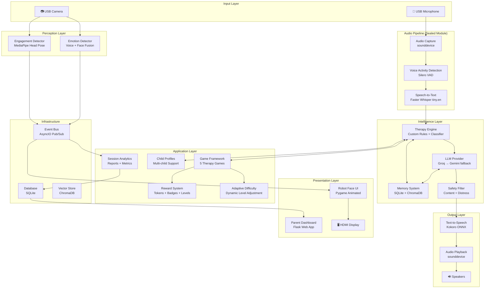

# BMO — Autism Companion Robot: Implementation Plan

> [!NOTE]
> This plan covers all 18 deliverables for a production-ready autism companion robot running on Raspberry Pi 5. The system provides real-time voice conversation, therapy games, emotion/engagement detection, and a parent dashboard.

---

## User Review Required

> [!IMPORTANT]
> **Existing Code**: The workspace is currently empty. The spec says "Do NOT modify existing Wake Word / Audio Pipeline / STT / TTS / GUI / Threading." Since there is no existing code, I will build all systems from scratch following the restriction that these core subsystems are treated as **sealed modules** — other components integrate with them through clean interfaces but never modify their internals.

> [!WARNING]
> **API Keys Required**: The project needs API keys for Groq (primary LLM) and Google Gemini (fallback LLM). Both have free tiers. You'll need to set `GROQ_API_KEY` and `GEMINI_API_KEY` environment variables before running.

> [!IMPORTANT]
> **Voice Model Files**: The spec references `bmo.onnx` and `bmo.onnx.json` custom voice files. If you have these files, please share them. Otherwise, I'll configure Kokoro with its default voice and document where to drop in the custom model.

> [!CAUTION]
> **Hardware Dependencies**: Camera-based engagement/emotion detection (MediaPipe), audio capture (sounddevice), and the Pygame display require physical hardware. Unit tests will mock these. Full integration testing requires a Raspberry Pi 5 setup.

---

## Open Questions

1. **Face Recognition Library**: For the Child Profile System, I plan to use the `face_recognition` library (which uses dlib) because it is highly accurate and very easy to save face encodings to SQLite. However, it requires compiling `dlib` which can be slow on a Raspberry Pi. The alternative is using a lightweight ONNX face feature extractor or OpenCV's EigenFace. Are you okay with `face_recognition` (best accuracy), or should we use something ultra-lightweight?
2. **Camera Usage**: Currently, the camera is started on `camera.py` and `EngagementDetector` processes the frame. Since we now need Face Registration AND Emotion Detection AND Attention Tracking, they will all share the `camera.frame` event.
3. **Database Schema**: We will need to add a `face_encoding` column to the `children` table to store the child's biometric ID.

---

## Architecture Overview



---

## Project Structure

```
c:\Users\misho\Downloads\Grad\11\
├── robot/
│   ├── __init__.py
│   ├── main.py                          # Application entry point
│   │
│   ├── config/
│   │   ├── __init__.py
│   │   ├── settings.py                  # All configuration constants
│   │   └── logging_config.py            # Structured logging setup
│   │
│   ├── audio/                           # ═══ SEALED MODULE ═══
│   │   ├── __init__.py
│   │   ├── capture.py                   # Mic input via sounddevice
│   │   └── playback.py                  # Speaker output + barge-in
│   │
│   ├── vad/                             # ═══ SEALED MODULE ═══
│   │   ├── __init__.py
│   │   └── silero_vad.py                # Voice activity detection
│   │
│   ├── stt/                             # ═══ SEALED MODULE ═══
│   │   ├── __init__.py
│   │   └── whisper_stt.py               # Faster Whisper transcription
│   │
│   ├── tts/                             # ═══ SEALED MODULE ═══
│   │   ├── __init__.py
│   │   └── kokoro_tts.py                # Kokoro ONNX synthesis
│   │
│   ├── llm/
│   │   ├── __init__.py
│   │   ├── base_provider.py             # Abstract LLM interface
│   │   ├── groq_provider.py             # Groq API (primary)
│   │   ├── gemini_provider.py           # Gemini API (fallback)
│   │   ├── provider_manager.py          # Auto-failover logic
│   │   └── prompt_templates.py          # System prompts for BMO
│   │
│   ├── therapy/
│   │   ├── __init__.py
│   │   ├── engine.py                    # Main therapy orchestrator
│   │   ├── interaction_classifier.py    # Classify: casual/therapy/game/etc.
│   │   ├── frustration_detector.py      # Detect child frustration
│   │   ├── rules.py                     # Therapy rule definitions
│   │   └── session_manager.py           # Session lifecycle
│   │
│   ├── games/
│   │   ├── __init__.py
│   │   ├── base_game.py                 # Abstract game framework
│   │   ├── game_registry.py             # Plugin registry for games
│   │   ├── colors_game.py               # Color identification
│   │   ├── emotions_game.py             # Emotion recognition
│   │   ├── speech_repeat_game.py        # Speech repetition
│   │   ├── turn_taking_game.py          # Conversation practice
│   │   └── focus_game.py                # Attention exercises
│   │
│   ├── memory/
│   │   ├── __init__.py
│   │   ├── short_term.py                # Conversation context buffer
│   │   ├── long_term.py                 # SQLite-backed persistent memory
│   │   └── vector_store.py              # ChromaDB semantic search
│   │
│   ├── profiles/
│   │   ├── __init__.py
│   │   └── child_profile.py             # Profile CRUD + personalization
│   │
│   ├── rewards/
│   │   ├── __init__.py
│   │   └── reward_system.py             # Tokens, badges, levels, celebrations
│   │
│   ├── difficulty/
│   │   ├── __init__.py
│   │   └── adaptive.py                  # Adaptive difficulty algorithm
│   │
│   ├── engagement/
│   │   ├── __init__.py
│   │   └── detector.py                  # MediaPipe head pose + engagement
│   │
│   ├── emotion/
│   │   ├── __init__.py
│   │   ├── voice_analyzer.py            # Librosa-based voice emotion
│   │   ├── face_analyzer.py             # MediaPipe landmark emotion
│   │   └── fusion.py                    # Multi-modal emotion fusion
│   │
│   ├── safety/
│   │   ├── __init__.py
│   │   ├── content_filter.py            # Child-safe response filter
│   │   └── distress_detector.py         # Multi-modal distress detection
│   │
│   ├── analytics/
│   │   ├── __init__.py
│   │   ├── session_tracker.py           # Real-time session metrics
│   │   └── reporter.py                  # JSON + SQLite report generation
│   │
│   ├── database/
│   │   ├── __init__.py
│   │   ├── connection.py                # SQLite connection manager
│   │   ├── schema.py                    # Table definitions
│   │   └── migrations.py               # Schema migration system
│   │
│   ├── services/
│   │   ├── __init__.py
│   │   ├── event_bus.py                 # AsyncIO pub/sub event system
│   │   └── service_registry.py          # Dependency injection container
│   │
│   ├── ui/                              # ═══ SEALED MODULE ═══
│   │   ├── __init__.py
│   │   ├── robot_face.py                # Pygame animated face
│   │   ├── expressions.py               # Expression definitions
│   │   └── animations.py               # Celebration/transition animations
│   │
│   ├── dashboard/
│   │   ├── __init__.py
│   │   ├── app.py                       # Flask app factory
│   │   ├── routes/
│   │   │   ├── __init__.py
│   │   │   ├── auth.py                  # Login/logout/register
│   │   │   ├── main.py                  # Dashboard home
│   │   │   ├── children.py              # Child profile management
│   │   │   ├── sessions.py              # Session history + detail
│   │   │   └── api.py                   # REST API for analytics
│   │   ├── templates/
│   │   │   ├── base.html
│   │   │   ├── login.html
│   │   │   ├── register.html
│   │   │   ├── dashboard.html
│   │   │   ├── child_profile.html
│   │   │   ├── session_detail.html
│   │   │   ├── analytics.html
│   │   │   └── achievements.html
│   │   └── static/
│   │       ├── css/
│   │       │   └── dashboard.css
│   │       └── js/
│   │           ├── charts.js
│   │           └── dashboard.js
│   │
│   └── tests/
│       ├── __init__.py
│       ├── conftest.py                  # Shared fixtures
│       ├── test_therapy_engine.py
│       ├── test_games.py
│       ├── test_memory.py
│       ├── test_rewards.py
│       ├── test_analytics.py
│       ├── test_safety.py
│       ├── test_difficulty.py
│       ├── test_profiles.py
│       ├── test_event_bus.py
│       └── test_integration.py
│
├── models/                              # AI model files
│   └── README.md                        # Instructions for model download
│
├── data/                                # Runtime data (gitignored)
│   ├── bmo.db                           # SQLite database
│   └── chromadb/                        # ChromaDB vector store
│
├── requirements.txt
├── setup.py
├── README.md
├── .env.example                         # API key template
└── deploy/
    ├── install.sh                       # RPi5 deployment script
    ├── bmo.service                      # systemd service file
    └── optimize.sh                      # RPi5 performance tuning
```

---

## Phase 14: Core System Expansions (Current Focus)

These five systems form the core intelligence of BMO's therapy capabilities.

### 1. Child Profile System & Face Recognition
**Goal:** If the robot sees a new face, ask for their name and create a profile.
- **[MODIFY] [camera.py](file:///c:/Users/misho/Downloads/Grad/11/robot/engagement/camera.py)**: Ensure it publishes `camera.frame` consistently.
- **[NEW] [face_recognition_service.py](file:///c:/Users/misho/Downloads/Grad/11/robot/engagement/face_recognition_service.py)**: 
  - Uses `face_recognition` (or similar lightweight model) to extract 128D face encodings.
  - Maintains an in-memory cache of known children from the DB.
  - If an unknown face is detected consistently for 3 seconds, emit an `unknown_face_detected` event.
- **[MODIFY] [session_manager.py](file:///c:/Users/misho/Downloads/Grad/11/robot/therapy/session_manager.py)**:
  - Subscribes to `unknown_face_detected`.
  - Triggers a "Registration Mode" in the LLM where BMO says: *"Hello! I don't think we've met. What is your name?"*
  - Uses a Groq function call to extract the name and save a new `ChildProfile` with their `face_encoding`.

### 2. Emotion Detection System (5-Second Polling)
**Goal:** Run emotion detection (happy, sad, angry, neutral, frustrated) every 5 seconds.
- **[MODIFY] [face_analyzer.py](file:///c:/Users/misho/Downloads/Grad/11/robot/emotion/face_analyzer.py)**:
  - Currently mocked. We will implement `fer` or a lightweight `TFLite` emotion model.
  - Setup a timer/frame-counter to only execute inference every 5 seconds (to save CPU on the Pi).
  - Emits `emotion.detected` to the event bus.
- **[MODIFY] [emotion_tracker.py](file:///c:/Users/misho/Downloads/Grad/11/robot/emotion/emotion_tracker.py)**:
  - Log emotions to the `emotion_log` database table for dashboard history.

### 3. Attention Tracking System
**Goal:** Track focus level, eye contact, and engagement.
- **[MODIFY] [detector.py](file:///c:/Users/misho/Downloads/Grad/11/robot/engagement/detector.py)**:
  - Upgrade from basic MediaPipe Face Detection to **MediaPipe Face Mesh**.
  - Calculate **Head Pose (Pitch/Yaw)** to determine if the child is looking at BMO.
  - Calculate **Eye Aspect Ratio (EAR)** / Iris tracking to detect eye contact.
  - Output an `engagement_score` (0.0 to 1.0) and emit `engagement.update`.

### 4. Progress Tracker
**Goal:** Store session history and improvements.
- **[NEW] [progress_tracker.py](file:///c:/Users/misho/Downloads/Grad/11/robot/therapy/progress_tracker.py)**:
  - Subscribes to session events.
  - Aggregates attention, speech, and emotion scores over the session.
  - Upon session end, updates moving averages in the `children` table (e.g., `attention_score`, `speech_score`) and inserts a full summary into the `sessions` table.

### 5. Decision Engine
**Goal:** Rules that choose the correct response based on emotion + attention.
- **[MODIFY] [engine.py](file:///c:/Users/misho/Downloads/Grad/11/robot/therapy/engine.py)** & **[rules.py](file:///c:/Users/misho/Downloads/Grad/11/robot/therapy/rules.py)**:
  - Inject real-time `attention_score` and `current_emotion` into the LLM system prompt.
  - **Rule 1 (Frustrated):** If emotion is frustrated/angry, force the LLM into a comforting, de-escalation tone and lower game difficulty.
  - **Rule 2 (Distracted):** If attention is < 0.4, append instructions for BMO to actively call the child's name and do something surprising to regain attention.
  - **Rule 3 (Happy/Engaged):** If attention is high, increase complexity and praise the child.

---

## Proposed Changes

### Phase 1: Infrastructure Foundation

#### [NEW] [settings.py](file:///c:/Users/misho/Downloads/Grad/11/robot/config/settings.py)
Central configuration with environment variable loading. All constants: audio sample rate (16kHz), VAD thresholds, model paths, API keys, database path, dashboard port. Uses `dataclass` for type safety.

#### [NEW] [logging_config.py](file:///c:/Users/misho/Downloads/Grad/11/robot/config/logging_config.py)
Structured logging with rotating file handler + console. Separate loggers for each module (audio, therapy, games, etc.).

#### [NEW] [event_bus.py](file:///c:/Users/misho/Downloads/Grad/11/robot/services/event_bus.py)
AsyncIO-based publish/subscribe event bus. Core events:
- `speech.started`, `speech.ended`, `speech.transcribed`
- `emotion.detected`, `engagement.changed`
- `game.started`, `game.completed`, `game.scored`
- `reward.earned`, `session.started`, `session.ended`
- `distress.detected`, `safety.alert`
- `ui.expression.change`, `ui.animation.trigger`

```python
class EventBus:
    async def publish(event: str, data: dict) -> None
    def subscribe(event: str, handler: Callable) -> None
    def unsubscribe(event: str, handler: Callable) -> None
```

#### [NEW] [service_registry.py](file:///c:/Users/misho/Downloads/Grad/11/robot/services/service_registry.py)
Simple dependency injection container. All services register at startup, retrieved by type. Ensures single instances and proper initialization order.

---

### Phase 2: Database Layer

#### [NEW] [connection.py](file:///c:/Users/misho/Downloads/Grad/11/robot/database/connection.py)
Thread-safe SQLite connection manager with WAL mode, foreign keys enabled, and connection pooling for the dashboard.

#### [NEW] [schema.py](file:///c:/Users/misho/Downloads/Grad/11/robot/database/schema.py)
Complete database schema — 10 tables:

```sql
-- Parent/Caregiver accounts (dashboard login)
CREATE TABLE caregivers (
    id              INTEGER PRIMARY KEY AUTOINCREMENT,
    username        TEXT UNIQUE NOT NULL,
    password_hash   TEXT NOT NULL,
    name            TEXT NOT NULL,
    email           TEXT,
    role            TEXT DEFAULT 'parent',
    created_at      TIMESTAMP DEFAULT CURRENT_TIMESTAMP
);

-- Child profiles with therapy metadata
CREATE TABLE children (
    id                  INTEGER PRIMARY KEY AUTOINCREMENT,
    caregiver_id        INTEGER NOT NULL REFERENCES caregivers(id),
    name                TEXT NOT NULL,
    age                 INTEGER,
    date_of_birth       DATE,
    communication_level TEXT DEFAULT 'verbal',     -- verbal/limited/nonverbal
    preferred_games     TEXT DEFAULT '[]',          -- JSON array
    favorite_topics     TEXT DEFAULT '[]',          -- JSON array
    attention_score     REAL DEFAULT 0.5,
    speech_score        REAL DEFAULT 0.5,
    difficulty_level    INTEGER DEFAULT 1,
    avatar              TEXT DEFAULT 'default',
    is_active           BOOLEAN DEFAULT 1,
    created_at          TIMESTAMP DEFAULT CURRENT_TIMESTAMP,
    updated_at          TIMESTAMP DEFAULT CURRENT_TIMESTAMP
);

-- Therapy sessions
CREATE TABLE sessions (
    id                  INTEGER PRIMARY KEY AUTOINCREMENT,
    child_id            INTEGER NOT NULL REFERENCES children(id),
    session_type        TEXT NOT NULL,              -- conversation/therapy/game
    start_time          TIMESTAMP NOT NULL,
    end_time            TIMESTAMP,
    duration_seconds    INTEGER,
    games_played        TEXT DEFAULT '[]',          -- JSON array
    words_spoken        INTEGER DEFAULT 0,
    attention_score     REAL,
    engagement_score    REAL,
    speech_score        REAL,
    mood_start          TEXT,
    mood_end            TEXT,
    difficulty_level    INTEGER,
    notes               TEXT,
    report_json         TEXT                        -- Full session report
);

-- Individual game/trial results
CREATE TABLE game_results (
    id                  INTEGER PRIMARY KEY AUTOINCREMENT,
    session_id          INTEGER NOT NULL REFERENCES sessions(id),
    child_id            INTEGER NOT NULL REFERENCES children(id),
    game_type           TEXT NOT NULL,
    difficulty_level    INTEGER,
    score               REAL,
    correct_count       INTEGER DEFAULT 0,
    total_count         INTEGER DEFAULT 0,
    response_time_avg   REAL,
    completed           BOOLEAN DEFAULT 0,
    data_json           TEXT,                       -- Game-specific data
    played_at           TIMESTAMP DEFAULT CURRENT_TIMESTAMP
);

-- Rewards and achievements
CREATE TABLE achievements (
    id                  INTEGER PRIMARY KEY AUTOINCREMENT,
    child_id            INTEGER NOT NULL REFERENCES children(id),
    achievement_type    TEXT NOT NULL,               -- star/badge/level
    achievement_id      TEXT NOT NULL,
    achievement_name    TEXT NOT NULL,
    description         TEXT,
    earned_at           TIMESTAMP DEFAULT CURRENT_TIMESTAMP,
    UNIQUE(child_id, achievement_id)
);

-- Reward token balance and history
CREATE TABLE rewards (
    id                  INTEGER PRIMARY KEY AUTOINCREMENT,
    child_id            INTEGER NOT NULL REFERENCES children(id),
    reward_type         TEXT NOT NULL,               -- star/token
    amount              INTEGER DEFAULT 1,
    reason              TEXT,
    earned_at           TIMESTAMP DEFAULT CURRENT_TIMESTAMP
);

-- Emotion detection log
CREATE TABLE emotion_log (
    id                  INTEGER PRIMARY KEY AUTOINCREMENT,
    child_id            INTEGER,
    session_id          INTEGER REFERENCES sessions(id),
    source              TEXT NOT NULL,               -- voice/face/context
    emotion             TEXT NOT NULL,
    confidence          REAL,
    timestamp           TIMESTAMP DEFAULT CURRENT_TIMESTAMP
);

-- Engagement tracking
CREATE TABLE engagement_log (
    id                  INTEGER PRIMARY KEY AUTOINCREMENT,
    child_id            INTEGER,
    session_id          INTEGER REFERENCES sessions(id),
    engaged             BOOLEAN,
    face_detected       BOOLEAN,
    pitch               REAL,
    yaw                 REAL,
    engagement_score    REAL,
    timestamp           TIMESTAMP DEFAULT CURRENT_TIMESTAMP
);

-- Long-term memory entries
CREATE TABLE memories (
    id                  INTEGER PRIMARY KEY AUTOINCREMENT,
    child_id            INTEGER NOT NULL REFERENCES children(id),
    memory_type         TEXT NOT NULL,               -- interest/preference/milestone/note
    category            TEXT,
    content             TEXT NOT NULL,
    importance          REAL DEFAULT 0.5,
    created_at          TIMESTAMP DEFAULT CURRENT_TIMESTAMP,
    last_referenced     TIMESTAMP
);

-- Safety/distress events
CREATE TABLE safety_events (
    id                  INTEGER PRIMARY KEY AUTOINCREMENT,
    child_id            INTEGER,
    session_id          INTEGER REFERENCES sessions(id),
    event_type          TEXT NOT NULL,               -- distress/content_block/session_limit
    severity            TEXT DEFAULT 'low',          -- low/medium/high
    details             TEXT,
    action_taken        TEXT,
    acknowledged        BOOLEAN DEFAULT 0,
    timestamp           TIMESTAMP DEFAULT CURRENT_TIMESTAMP
);
```

#### [NEW] [migrations.py](file:///c:/Users/misho/Downloads/Grad/11/robot/database/migrations.py)
Version-tracked schema migrations. Stores current version in a `schema_version` table. Runs automatically on startup.

---

### Phase 3: Audio & Voice Pipeline (Sealed Modules)

#### [NEW] [capture.py](file:///c:/Users/misho/Downloads/Grad/11/robot/audio/capture.py)
Continuous microphone capture using `sounddevice` callback mode. Outputs 512-sample chunks (32ms at 16kHz) to an asyncio queue. Configurable device selection for USB microphone.

#### [NEW] [playback.py](file:///c:/Users/misho/Downloads/Grad/11/robot/audio/playback.py)
Audio playback with **barge-in support**: plays TTS audio through speakers, can be interrupted immediately when VAD detects new speech. Non-blocking playback with a cancel mechanism.

#### [NEW] [silero_vad.py](file:///c:/Users/misho/Downloads/Grad/11/robot/vad/silero_vad.py)
Silero VAD wrapper with `VADIterator`. Tuned for child speech:
- `threshold=0.4` (slightly more sensitive for quiet children)
- `min_silence_duration_ms=250` (aggressive for low latency)
- `speech_pad_ms=50`

Emits `speech.started` and `speech.ended` events with the buffered audio.

#### [NEW] [whisper_stt.py](file:///c:/Users/misho/Downloads/Grad/11/robot/stt/whisper_stt.py)
Faster Whisper with `tiny.en` model, `int8` quantization, `beam_size=1`. Transcribes buffered speech segments from VAD. Emits `speech.transcribed` event. Model pre-loaded at startup with warmup call.

#### [NEW] [kokoro_tts.py](file:///c:/Users/misho/Downloads/Grad/11/robot/tts/kokoro_tts.py)
Kokoro ONNX TTS with streaming sentence synthesis. Loads `bmo.onnx` custom voice (falls back to default). Splits incoming text at sentence boundaries and streams audio chunks to playback. Pre-loaded at startup.

---

### Phase 4: LLM Integration

#### [NEW] [base_provider.py](file:///c:/Users/misho/Downloads/Grad/11/robot/llm/base_provider.py)
Abstract base class:
```python
class LLMProvider(ABC):
    async def stream_chat(messages: list[dict], max_tokens: int) -> AsyncIterator[str]
    async def chat(messages: list[dict], max_tokens: int) -> str
```

#### [NEW] [groq_provider.py](file:///c:/Users/misho/Downloads/Grad/11/robot/llm/groq_provider.py)
Groq API client using `llama-3.3-70b-versatile` with streaming. Rate limit tracking via response headers. Raises `RateLimitError` for failover.

#### [NEW] [gemini_provider.py](file:///c:/Users/misho/Downloads/Grad/11/robot/llm/gemini_provider.py)
Google Gemini client using `gemini-2.5-flash` with streaming. Fallback provider.

#### [NEW] [provider_manager.py](file:///c:/Users/misho/Downloads/Grad/11/robot/llm/provider_manager.py)
Auto-failover: tries Groq first, catches rate limit errors, falls back to Gemini. Tracks per-provider health metrics. Implements exponential backoff.

#### [NEW] [prompt_templates.py](file:///c:/Users/misho/Downloads/Grad/11/robot/llm/prompt_templates.py)
BMO persona system prompts. Short (~80 tokens) for low TTFT. Variants for: casual conversation, therapy guidance, game narration, emotion coaching. All prompts enforce child-safe, encouraging language.

---

### Phase 5: Memory System

#### [NEW] [short_term.py](file:///c:/Users/misho/Downloads/Grad/11/robot/memory/short_term.py)
Rolling conversation buffer (last 10 turns). Stores current activity context, recent emotions, engagement state. In-memory only, reset per session.

#### [NEW] [long_term.py](file:///c:/Users/misho/Downloads/Grad/11/robot/memory/long_term.py)
SQLite-backed persistent memory. CRUD operations on the `memories` table. Tracks interests, preferences, achievements, therapy milestones. Provides context injection for LLM prompts:
```python
async def get_context_for_child(child_id: int) -> str:
    """Returns personalized context string for LLM system prompt."""
```

#### [NEW] [vector_store.py](file:///c:/Users/misho/Downloads/Grad/11/robot/memory/vector_store.py)
ChromaDB semantic memory. Collections: `session_notes`, `child_preferences`, `effective_strategies`. Enables natural references like "Last time we played the colors game..."

---

### Phase 6: Therapy Engine (Core Innovation)

#### [NEW] [engine.py](file:///c:/Users/misho/Downloads/Grad/11/robot/therapy/engine.py)
**The central orchestrator** between STT and LLM. Pipeline:

1. Receive transcribed text from STT
2. Classify interaction type (via `interaction_classifier`)
3. Check frustration level (via `frustration_detector`)
4. Apply therapy rules (via `rules`)
5. Enrich/modify the LLM prompt based on therapy context
6. Select appropriate system prompt variant
7. Inject memory context
8. Forward to LLM

```python
class TherapyEngine:
    async def process(self, text: str, child_id: int) -> TherapyContext:
        """Process child's speech and prepare therapy-aware LLM request."""
        interaction = self.classifier.classify(text)
        frustration = self.frustration_detector.check(text, child_id)
        rules = self.rules.get_active_rules(child_id, interaction, frustration)
        context = self._build_context(text, interaction, frustration, rules)
        return context
```

#### [NEW] [interaction_classifier.py](file:///c:/Users/misho/Downloads/Grad/11/robot/therapy/interaction_classifier.py)
Keyword + pattern-based classifier. Categories:
- `casual_conversation` — general chat
- `therapy_session` — structured therapy activity
- `game_session` — playing a therapy game
- `emotion_coaching` — discussing feelings
- `speech_practice` — pronunciation/vocabulary
- `attention_training` — focus exercises

Uses keyword dictionaries, regex patterns, and context from short-term memory.

#### [NEW] [frustration_detector.py](file:///c:/Users/misho/Downloads/Grad/11/robot/therapy/frustration_detector.py)
Multi-signal frustration detection:
- **Verbal cues**: "I can't", "too hard", "I don't want to", silence, yelling
- **Behavioral cues**: from emotion detector (angry/frustrated face/voice)
- **Performance cues**: repeated failures, long response times
- Outputs frustration level 0-5. Triggers difficulty reduction or comfort mode at high levels.

#### [NEW] [rules.py](file:///c:/Users/misho/Downloads/Grad/11/robot/therapy/rules.py)
Therapy rule definitions:
- Max sentence complexity based on communication level
- Positive reinforcement frequency rules
- Topic transition rules (don't abruptly change)
- Session pacing rules (breaks every N minutes)
- Vocabulary level constraints
- Response length limits (shorter for younger/lower-level children)

#### [NEW] [session_manager.py](file:///c:/Users/misho/Downloads/Grad/11/robot/therapy/session_manager.py)
Session lifecycle: start → activity selection → monitoring → wrap-up → report. Enforces session time limits. Tracks session state machine.

---

### Phase 7: Game Framework

#### [NEW] [base_game.py](file:///c:/Users/misho/Downloads/Grad/11/robot/games/base_game.py)
Abstract base class — all games implement this interface:

```python
class BaseGame(ABC):
    @abstractmethod
    async def start(self, child_id: int, difficulty: int) -> str
    
    @abstractmethod
    async def evaluate(self, response: str) -> GameResult
    
    @abstractmethod
    async def reward(self, result: GameResult) -> RewardEvent
    
    @abstractmethod
    async def finish(self) -> GameSummary

    def get_hint(self) -> str
    def get_encouragement(self) -> str
```

`GameResult` dataclass: `correct: bool`, `score: float`, `response_time: float`, `feedback: str`
`GameSummary` dataclass: total score, correct count, total count, time spent, difficulty achieved

#### [NEW] [game_registry.py](file:///c:/Users/misho/Downloads/Grad/11/robot/games/game_registry.py)
Plugin registry pattern — games register themselves. New games added without modifying existing code:
```python
@GameRegistry.register("colors")
class ColorsGame(BaseGame): ...
```

#### [NEW] [colors_game.py](file:///c:/Users/misho/Downloads/Grad/11/robot/games/colors_game.py)
**Color Identification Game**. 5 difficulty levels:
1. Name the color shown (2 colors: red, blue)
2. Name the color (4 colors)
3. "What color is a banana?" (contextual)
4. "Mix red and blue — what do you get?" (color mixing)
5. Describe objects by their colors

#### [NEW] [emotions_game.py](file:///c:/Users/misho/Downloads/Grad/11/robot/games/emotions_game.py)
**Emotion Recognition Game**. 5 difficulty levels:
1. Identify happy vs. sad (2 emotions)
2. Identify from 4 emotions
3. "How would you feel if..." (contextual)
4. "What makes someone feel [emotion]?"
5. Describe mixed/subtle emotions

#### [NEW] [speech_repeat_game.py](file:///c:/Users/misho/Downloads/Grad/11/robot/games/speech_repeat_game.py)
**Speech Repetition Game**. Uses STT to evaluate. 5 levels:
1. Single words (cat, dog, ball)
2. Two-word phrases
3. Short sentences
4. Tongue twisters / complex words
5. Story sentences

Scoring: Levenshtein similarity between target and recognized speech.

#### [NEW] [turn_taking_game.py](file:///c:/Users/misho/Downloads/Grad/11/robot/games/turn_taking_game.py)
**Conversation Turn-Taking Game**. Structured dialogues where BMO and child alternate:
1. Simple call-and-response
2. Finish the sentence
3. Question-and-answer
4. Story building (each adds a sentence)
5. Open conversation with topic prompts

#### [NEW] [focus_game.py](file:///c:/Users/misho/Downloads/Grad/11/robot/games/focus_game.py)
**Attention/Focus Game**. Uses engagement detector:
1. "Listen carefully" — BMO says items, child recalls
2. "Simon Says" — follow instructions
3. Sequential pattern recall
4. Multi-step instructions
5. Sustained attention challenges

---

### Phase 8: Adaptive Difficulty & Rewards

#### [NEW] [adaptive.py](file:///c:/Users/misho/Downloads/Grad/11/robot/difficulty/adaptive.py)
Targets **75% success rate** (flow state). Sliding window of last 10 responses:
- Accuracy ≥ 85% → increase difficulty
- Accuracy ≤ 60% → decrease difficulty
- Factors in response time and engagement score
- Persists per-child, per-game difficulty in database

#### [NEW] [reward_system.py](file:///c:/Users/misho/Downloads/Grad/11/robot/rewards/reward_system.py)
Complete gamification:
- **Stars**: earned per correct answer (1-3 based on difficulty)
- **Badges**: milestone achievements (First Session, 3-Day Streak, Emotion Detective, etc.)
- **Levels**: XP-based leveling (thresholds: 50, 120, 210, 320, 450, ...)
- **Celebrations**: triggers UI animations (confetti, fireworks, dance)
- Emits `reward.earned` events for UI and analytics

---

### Phase 9: Perception (Engagement + Emotion)

#### [NEW] [detector.py](file:///c:/Users/misho/Downloads/Grad/11/robot/engagement/detector.py)
MediaPipe Face Mesh + solvePnP head pose estimation. Runs at 10 FPS (camera capture on background thread). Engagement states:
- **Engaged**: face detected, yaw < 20°, pitch < 20°
- **Distracted**: face detected but looking away
- **Absent**: no face for > 5 seconds

Publishes rolling engagement score (0.0-1.0) via event bus.

#### [NEW] [voice_analyzer.py](file:///c:/Users/misho/Downloads/Grad/11/robot/emotion/voice_analyzer.py)
Lightweight voice emotion using `librosa` MFCC features + pre-trained sklearn MLP. Analyzes the same audio buffer from VAD. 7 emotions: happy, sad, excited, frustrated, angry, confused, neutral.

#### [NEW] [face_analyzer.py](file:///c:/Users/misho/Downloads/Grad/11/robot/emotion/face_analyzer.py)
MediaPipe landmarks → feature vector → TFLite classifier. Reuses the face mesh from engagement detector (shared camera pipeline). 5 emotions: happy, sad, angry, surprised, neutral.

#### [NEW] [fusion.py](file:///c:/Users/misho/Downloads/Grad/11/robot/emotion/fusion.py)
Weighted fusion of voice + face + context signals. Voice weight: 0.4, Face weight: 0.4, Context weight: 0.2. Outputs single emotion + confidence. Smoothing over last 5 readings to avoid flicker.

---

### Phase 10: Safety System

#### [NEW] [content_filter.py](file:///c:/Users/misho/Downloads/Grad/11/robot/safety/content_filter.py)
Filters LLM output before TTS:
- Banned word/phrase list (violence, scary content, inappropriate topics)
- Max complexity check (Flesch-Kincaid grade level)
- Replaces filtered content with safe alternatives
- Logs all filtering events

#### [NEW] [distress_detector.py](file:///c:/Users/misho/Downloads/Grad/11/robot/safety/distress_detector.py)
Multi-modal distress detection:
- Combines face emotion + voice emotion + engagement + verbal cues
- Scoring: sustained negative state (>60s) = medium alert, severe (crying, yelling) = high alert
- High alert: logs to `safety_events`, pauses session, switches to comfort mode, notifies dashboard
- Session time limit enforcement (configurable, default 30 min)

---

### Phase 11: Analytics & Child Profiles

#### [NEW] [session_tracker.py](file:///c:/Users/misho/Downloads/Grad/11/robot/analytics/session_tracker.py)
Real-time session metrics collection. Subscribes to event bus events. Tracks: duration, games played, words spoken, attention/engagement/speech scores, emotions detected, achievements earned.

#### [NEW] [reporter.py](file:///c:/Users/misho/Downloads/Grad/11/robot/analytics/reporter.py)
Post-session report generation:
- Full JSON report saved to `sessions.report_json`
- Daily rollup aggregation
- Trend analysis (improving/declining/stable)
- REST API data formatters for dashboard

#### [NEW] [child_profile.py](file:///c:/Users/misho/Downloads/Grad/11/robot/profiles/child_profile.py)
Profile management:
- Create/update/delete profiles
- Auto-load active child on session start
- Personalization engine: adapts greetings, topics, difficulty based on profile
- Progress tracking: updates scores after each session

---

### Phase 12: Presentation Layer

#### [NEW] [robot_face.py](file:///c:/Users/misho/Downloads/Grad/11/robot/ui/robot_face.py)
Pygame animated robot face. States: Idle, Listening, Thinking, Speaking, Happy, Encouraging, Celebrating. Features:
- Smooth expression transitions (tweening)
- Natural blinking (random 2-5s intervals)
- Mouth animation synced with TTS playback
- Pupil tracking (subtle movement)
- Celebration animations (confetti, stars, fireworks)
- Status text display at bottom

#### [NEW] [expressions.py](file:///c:/Users/misho/Downloads/Grad/11/robot/ui/expressions.py)
Expression parameter definitions (eye height, mouth curve, pupil size, colors) for all 7 states. Color palette designed to be calming and child-friendly.

#### [NEW] [animations.py](file:///c:/Users/misho/Downloads/Grad/11/robot/ui/animations.py)
Particle system for celebrations. Star burst, confetti rain, gentle pulse effects. Each animation runs for 2-3 seconds, non-blocking.

---

#### Parent Dashboard — Flask Web App

#### [NEW] [app.py](file:///c:/Users/misho/Downloads/Grad/11/robot/dashboard/app.py)
Flask app factory with Flask-Login authentication. Runs on port 5000, accessible on local network. Mobile-responsive.

#### [NEW] [auth.py](file:///c:/Users/misho/Downloads/Grad/11/robot/dashboard/routes/auth.py)
Login, logout, registration routes. Password hashing with werkzeug. Session-based auth.

#### [NEW] [main.py](file:///c:/Users/misho/Downloads/Grad/11/robot/dashboard/routes/main.py)
Dashboard home: overview cards (active children, recent sessions, engagement trends).

#### [NEW] [children.py](file:///c:/Users/misho/Downloads/Grad/11/robot/dashboard/routes/children.py)
Child profile CRUD: add/edit/view children. Profile page with progress charts.

#### [NEW] [sessions.py](file:///c:/Users/misho/Downloads/Grad/11/robot/dashboard/routes/sessions.py)
Session history list + detailed session view with full analytics.

#### [NEW] [api.py](file:///c:/Users/misho/Downloads/Grad/11/robot/dashboard/routes/api.py)
REST API endpoints for AJAX chart data:
- `GET /api/children/<id>/progress` — progress over time
- `GET /api/children/<id>/emotions` — emotion trend data
- `GET /api/children/<id>/engagement` — engagement trend data
- `GET /api/sessions/<id>/report` — full session report JSON
- `GET /api/safety/alerts` — unacknowledged safety events

#### [NEW] Dashboard templates (6 HTML files)
Modern, mobile-friendly dashboard using Chart.js for visualizations. Dark theme option. Cards, tables, and charts for all analytics data.

#### [NEW] [dashboard.css](file:///c:/Users/misho/Downloads/Grad/11/robot/dashboard/static/css/dashboard.css)
Responsive CSS with CSS variables for theming. Mobile-first design with flexbox/grid layouts.

---

### Phase 13: Main Application & Pipeline

#### [NEW] [main.py](file:///c:/Users/misho/Downloads/Grad/11/robot/main.py)
Application entry point. Initializes all services in dependency order:
1. Config → Logger → Database (migrations)
2. Event Bus → Service Registry
3. Audio Capture → VAD → STT (model warmup)
4. TTS (model warmup) → Audio Playback
5. Memory (SQLite + ChromaDB)
6. LLM Provider Manager
7. Therapy Engine → Game Registry
8. Engagement Detector → Emotion Detector
9. Safety System → Analytics
10. Robot Face UI (Pygame, separate thread)
11. Dashboard (Flask, separate thread)
12. Main voice pipeline loop (AsyncIO)

The main loop:
```python
async def main_loop():
    while running:
        # Audio capture feeds VAD continuously
        # VAD emits speech.ended with audio buffer
        # Pipeline: STT → Therapy Engine → LLM → Safety → TTS → Playback
        # Engagement + Emotion run continuously on background threads
        # Events flow through EventBus to UI, Analytics, Safety
```

---

### Phase 14: Tests

#### [NEW] Unit tests (10 test files)
- **test_therapy_engine.py**: Interaction classification, frustration detection, rule application
- **test_games.py**: All 5 games — start, evaluate, reward, finish lifecycle
- **test_memory.py**: Short-term buffer, long-term CRUD, vector search
- **test_rewards.py**: Star/badge/level earning, XP calculations
- **test_analytics.py**: Session tracking, report generation
- **test_safety.py**: Content filtering, distress detection thresholds
- **test_difficulty.py**: Adaptive algorithm step-up/step-down logic
- **test_profiles.py**: Profile CRUD, personalization
- **test_event_bus.py**: Pub/sub, async handlers
- **test_integration.py**: End-to-end pipeline (mocked audio/camera)

#### [NEW] [conftest.py](file:///c:/Users/misho/Downloads/Grad/11/robot/tests/conftest.py)
Shared fixtures: in-memory SQLite database, mock event bus, sample child profiles, mock audio buffers.

---

### Phase 15: Deployment & Documentation

#### [NEW] [requirements.txt](file:///c:/Users/misho/Downloads/Grad/11/requirements.txt)
All pip dependencies with pinned versions.

#### [NEW] [.env.example](file:///c:/Users/misho/Downloads/Grad/11/.env.example)
Template for API keys and configuration.

#### [NEW] [README.md](file:///c:/Users/misho/Downloads/Grad/11/README.md)
Project overview, setup instructions, architecture diagram, usage guide.

#### [NEW] [install.sh](file:///c:/Users/misho/Downloads/Grad/11/deploy/install.sh)
RPi5 deployment script: system deps, pip install, model downloads, database init, systemd service setup.

#### [NEW] [bmo.service](file:///c:/Users/misho/Downloads/Grad/11/deploy/bmo.service)
systemd unit file for auto-start on boot.

#### [NEW] [optimize.sh](file:///c:/Users/misho/Downloads/Grad/11/deploy/optimize.sh)
RPi5 performance tuning: CPU governor, swap config, GPU memory split, audio latency.

---

## Verification Plan

### Automated Tests
```bash
# Run all unit tests
cd c:\Users\misho\Downloads\Grad\11
python -m pytest robot/tests/ -v --tb=short

# Run with coverage
python -m pytest robot/tests/ --cov=robot --cov-report=html
```

### Manual Verification
1. **Database**: Verify all 10 tables created correctly, migrations run
2. **Event Bus**: Verify pub/sub with test events
3. **Therapy Engine**: Test interaction classification with sample inputs
4. **Games**: Run each game through full lifecycle with simulated responses
5. **Dashboard**: Start Flask server, verify login, child profiles, session views
6. **Safety**: Verify content filtering blocks unsafe content
7. **Rewards**: Verify badge earning and level-up logic
8. **Analytics**: Generate sample session report, verify JSON output

### Integration (Requires RPi5 Hardware)
- Full voice pipeline: speak → transcribe → respond → synthesize
- Camera engagement detection with live video
- Pygame face display on HDMI
- Dashboard accessible from phone on same network

---

## Implementation Order & Dependencies

```mermaid
gantt
    title BMO Implementation Phases
    dateFormat X
    axisFormat %s

    section Foundation
    Config + Logging           :done, p1a, 0, 1
    Event Bus + DI             :done, p1b, 0, 1
    Database Schema + Migrations :p2, 1, 2

    section Voice Pipeline
    Audio Capture + Playback   :p3a, 2, 3
    VAD (Silero)               :p3b, 3, 4
    STT (Whisper)              :p3c, 4, 5
    TTS (Kokoro)               :p3d, 4, 5
    LLM Providers              :p4, 3, 5

    section Intelligence
    Memory System              :p5, 2, 4
    Therapy Engine             :p6, 5, 7
    Game Framework + 5 Games   :p7, 5, 8
    Adaptive Difficulty        :p8a, 7, 8
    Reward System              :p8b, 7, 8

    section Perception
    Engagement Detector        :p9a, 3, 5
    Emotion Detection          :p9b, 3, 5
    Safety System              :p10, 7, 8

    section Presentation
    Pygame Robot Face           :p11, 5, 7
    Parent Dashboard            :p12, 4, 8

    section Integration
    Main Pipeline + Tests      :p13, 8, 10
    Child Profiles + Analytics :p14, 8, 9
    Deployment Scripts         :p15, 9, 10
```



---

## Estimated File Count
- **Python source files**: ~55 files
- **HTML templates**: ~8 files
- **CSS/JS**: ~3 files
- **Config/deploy**: ~6 files
- **Tests**: ~11 files
- **Total**: ~83 files

---

## Phase 17: Custom Emotion Model (CALMED Dataset)

### Objective
Replace the heuristic-based emotion detection with a custom machine learning model trained on the **CALMED** (Children, Autism, Multimodal, Emotion, Detection) dataset referenced in arXiv paper **2307.13706**.

### Proposed Changes

1. **`scripts/train_calmed_emotion.py`**
   - A standalone training pipeline script that the user can run on their PC.
   - Loads the CALMED dataset (audio + video features).
   - Trains a lightweight Multi-Layer Perceptron (MLP) or Random Forest using `scikit-learn` or `pytorch`.
   - Maps the CALMED target classes (Green, Yellow, Red, Blue zones) to BMO's internal emotion labels.
   - Exports the trained model to the ONNX format (`models/calmed_emotion.onnx`) for high-performance inference on the RPi 5.

2. **Update `robot/emotion/voice_analyzer.py` & `face_analyzer.py`**
   - Refactor these classes to check for the presence of `models/calmed_emotion.onnx`.
   - If the ONNX model is found, load it via `onnxruntime` and run inference on live `librosa` / `MediaPipe` features.
   - If the model is not found, fall back to the existing heuristic-based system to ensure the robot still functions out-of-the-box.

### Open Questions for User
1. Do you already have the raw CALMED dataset files (CSV features, etc.) downloaded locally? (Clinical datasets often require manual request forms and aren't typically a simple `wget` download).
2. The CALMED dataset uses OpenFace for video features, but we are using MediaPipe for the robot's real-time performance on RPi5. The training script can train solely on the Audio features, or we can attempt to map MediaPipe landmarks to the OpenFace format. Would you prefer an Audio-only model or an Audio+Video multimodal model?

